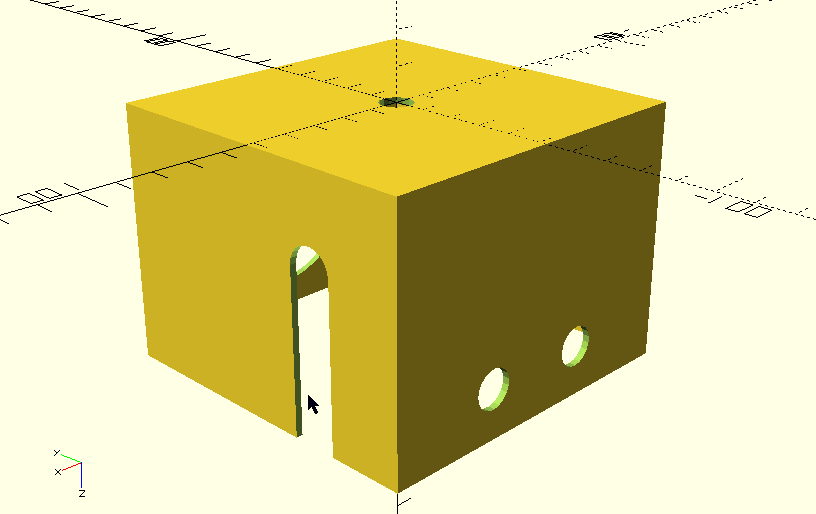

**OpenSCAD model of TJBot**

This folder contains an OpenSCAD code to generate the TJBot parts.

OpenSCAD is available at [www.openscad.org](www.openscad.org)

Measurements have been taken using Sketchup from the imported models, see [sketchup\readme.MD](..\sketchup\readme.MD)

__Contents__
   * Refer to the [TJBot.scad](TJBot.scad) file for implementation details
   * Rendering of the head:  

__Currently modeled parts__
  * Part #13: `Head`: [TJBot_13_Head_FromScad.stl](TJBot_13_Head_FromScad.stl)
