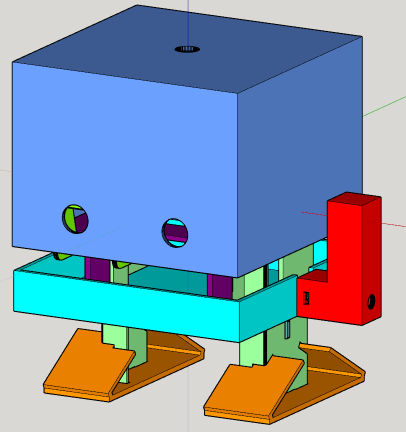

**Sketchup files for TJBot**

I created the files from the STL files in https://github.com/ibmtjbot/ibmtjbot.github.io/blob/master/images/TJBot3DPrintFiles.zip

__Contents__

   * Individual files numbered from 1 to 14 that are the exact import from STL, at same position.
   * The TJBot_Raw.skp is an import of all the STL files at their original location, one per layer.
   * TJBot.skp is an attempt to virtually re-assemble the robot by putting all the pieces in their correct location (and duplicating the piece number 8 camera sides). Each piece is in its own layer and has a different color to easily allow showing various aspects of TJBot.

Note that the in the individual and raw file, Top view from sketchup is actually the face view, with TJBot lying on its right flank.

In the full view I put TJBot back on its feet so that the face view is properly aligned:
